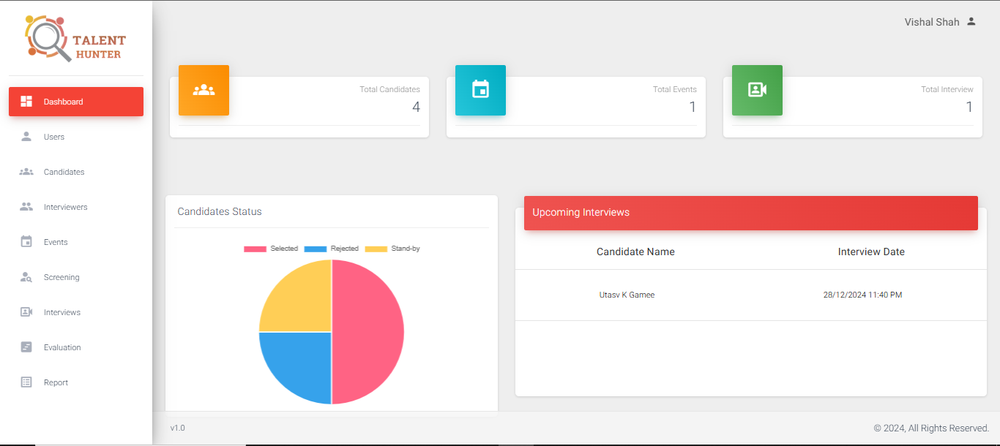

# Talent-Acquisition-System

A talent acquisition system allows you to develop a robust pipeline for sourcing, screening, interviewing, and evaluating candidates. The talent acquisition process is referred to as a function of talent procurement, but it also involves talent tracking, forecasting, assessment, and development.

